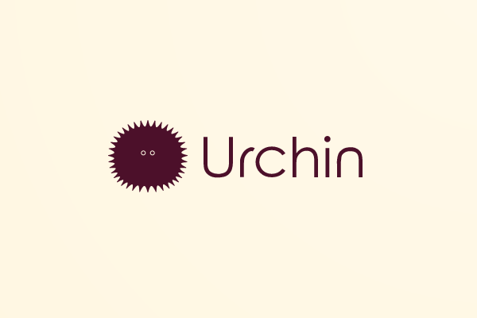

[](#) [](#) [](#) [](#)


[](http://gulpjs.com/)


:ocean: Full component and module toolkit for starting HTML-based projects. 

## Introduction
Urchin was developed to give beginner developers a way to quickly create a front-end interface without having to comb through hundreds of lines of source code and insert their own information. All a user needs to do is update the configuration file with their preferred settings and run the setup command. Urchin takes care of the rest, and builds a fully-populated set of files that are ready-to-use. 

## Table of Contents
- [System Requirements](#system-requirements)
- [Quick Start](#inbox_tray-quick-start)
- [Configuration](#configuration)
- [Usage](#usage)
- [Features](#features)
- [Updates](#updates)
- [Contributing](#contributing)
- [Credits](#credits)

## System Requirements
- Node.js ~14.15.0
- NPM ~6.14.8
    
Urchin uses a core set of packages for its functionality:

*Focus*                             |  *Tool(s)*
------------------------------------|------------------------------------------------------------------------------------
Engine                              | Node.js
Primary Functions                   | Javascript
Build and Deployment Automation     | Gulp
View Engine                         | Pug
Front-End                           | Bootstrap
Styling                             | SASS

## :inbox_tray: Quick Start

To get started, first go to the `config.json` file and edit the configuration objects, adding your personal information and application build preferences.
Then, run the setup script from the root directory.

```
npm run setup
```

This will install all required modules, run Gulp task automation, and compile application components. It also compiles all Pug templates into their HTML equivalents, with all variables prep-populated with the data entered in `settings`. 

```bash
├──.github
├── dist
├── docs
|   ├── documentation.html
├── src /
|   ├── assets /
|   |   ├── data
|   |   ├── fonts
|   |   ├── html
|   |   ├── images
|   |   ├── js
|   |   ├── scss
|   |   ├── vendors
|   ├── index.html
.gitignore
 config.json
 gulpfile.js
 LICENSE
 package.json
 README.md
```